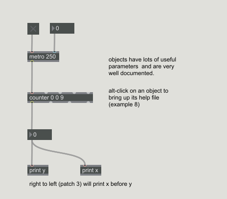
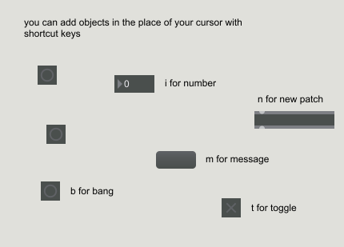

## Elementary Forms

### Here are the patches contained in this repo:

<!--- ---------------------------- --->
Patch 1 - (Bang) [(see it in action)](./photos/01_bang.gif)   
  

<!--- ---------------------------- --->
Patch 2 - (Objects) [(see it in action)](./photos/02_objects.gif)   

<!--- ---------------------------- --->
Patch 3 - (Right-to-Left and Print) [(see it in action)](./photos/03_rtol_print.gif)   

<!--- ---------------------------- --->
Patch 4 - (Counter)  

<!--- ---------------------------- --->
Patch 5a - (Addition)  

<!--- ---------------------------- --->
Patch 5b - (Division)  

<!--- ---------------------------- --->
Patch 6 - (Adding new objects) [(see it in action)](./photos/06_adding_objects.gif)   

<!--- ---------------------------- --->
Patch 7 - (Copying objects) [(see it in action)](./photos/07_copying_elements.gif)   

<!--- ---------------------------- --->
Patch 8 - (Getting Help) [(see it in action)](./photos/08_getting_help.gif)   

<!--- ---------------------------- --->
Patch 9 - (Changing Attributes) [(see it in action)](./photos/09_changing_attributes.gif)   
