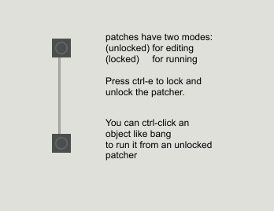

## Elementary Forms

### Here are the patches contained in this repo:

<!--- ---------------------------- --->
Patch 1 - (Bang)  

<!--- ---------------------------- --->
Patch 2 - (Metro)  

<!--- ---------------------------- --->
Patch 3 - (Print)  

<!--- ---------------------------- --->
Patch 4 - (Counter)  

<!--- ---------------------------- --->
Patch 5a - (Addition)  

<!--- ---------------------------- --->
Patch 5b - (Division)  
