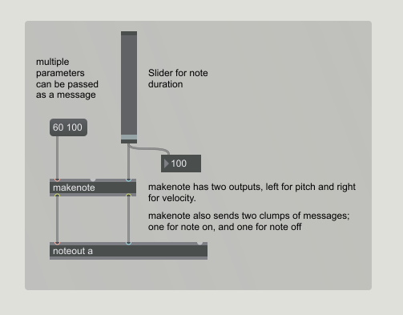

## Elementary Forms

### Here are the patches contained in this repo:

<!--- ---------------------------- --->
Patch 1 - (Note Out using makenote) [(see it in action)](./videos/01_noteout.mp4)   

<!--- ---------------------------- --->
Patch 2 - (Note On and Off) [(see it in action)](./videos/02_note_on_off.mp4)   

<!--- ---------------------------- --->
Patch 3 - (Simple Chromatic Scale)  [(see it in action)](./videos/03_simple_chromatic.mp4)   

<!--- ---------------------------- --->
Patch 4 - (Multi Slider) [(see it in action)](./videos/04_multislider.mp4)   

<!--- ---------------------------- --->
Patch 5 - (Pack a List with Multislider)  [(see it in action)](./videos/05_pack_multislider.mp4)   
